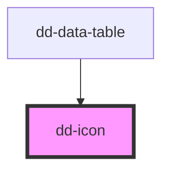

# dd-icon

<!-- Auto Generated Below -->

## Properties

| Property | Attribute | Description | Type                                                                       | Default       |
| -------- | --------- | ----------- | -------------------------------------------------------------------------- | ------------- |
| `name`   | `name`    |             | `string`                                                                   | `undefined`   |
| `size`   | `size`    |             | `IconSize.lg \| IconSize.md \| IconSize.sm \| IconSize.xl \| IconSize.xxl` | `IconSize.md` |
| `src`    | `src`     |             | `string`                                                                   | `undefined`   |

## Dependencies

### Used by

 - [dd-data-table](../data-table)

### Graph

----------------------------------------------

*Built with [StencilJS](https://stenciljs.com/)*
